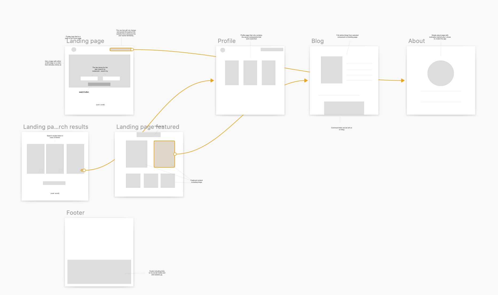
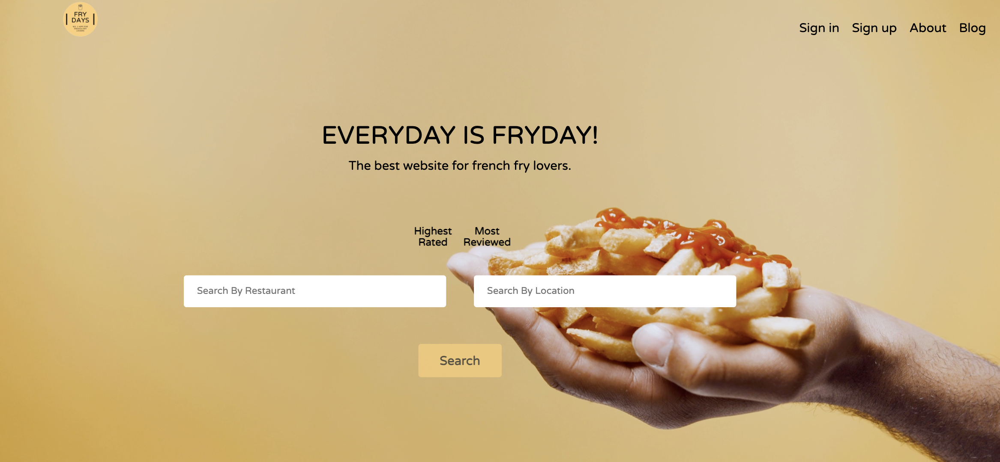
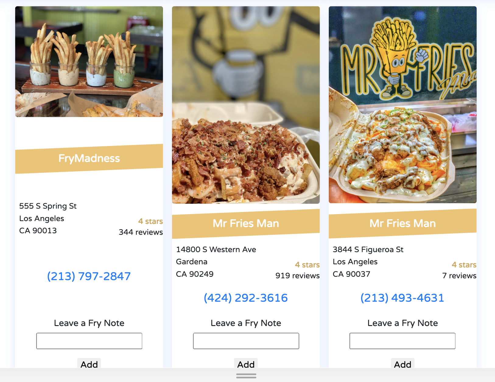
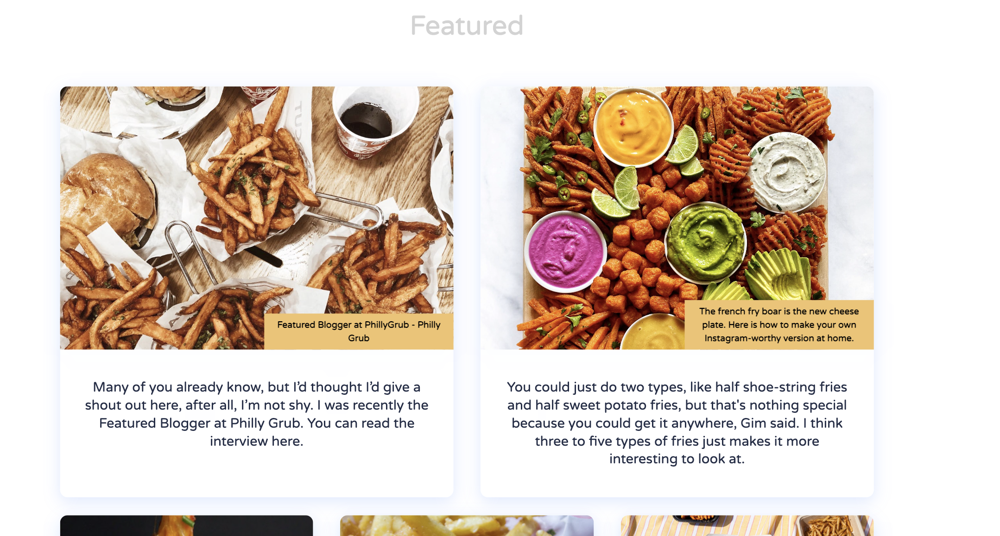
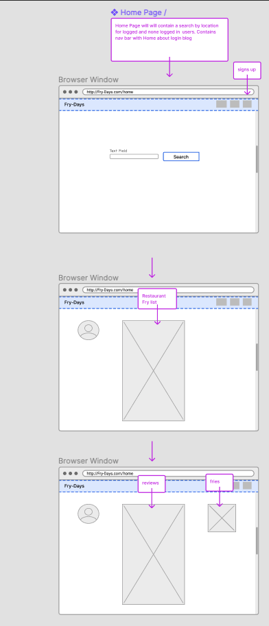
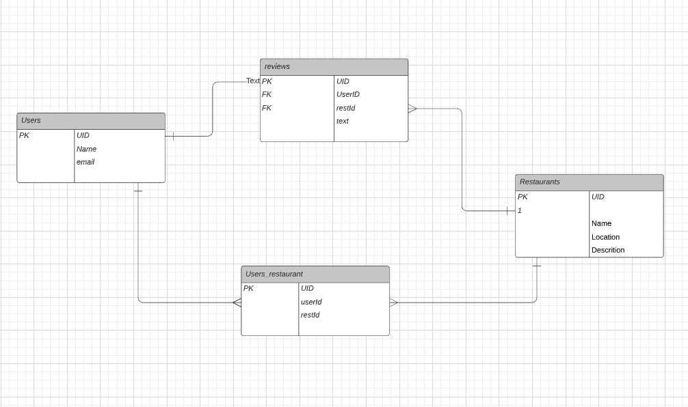

# Capstone Branch Slides


[Capstone Slides](https://docs.google.com/presentation/d/1Y3XJUJ77yuzNl9LXIb_0c45hzi9hgQaIjSgF-2W3O_c/edit?)

[UX-Engineering Starter Pack](https://github.com/bevonbrye/UX-Engineering)

# Fry Day (V2) 

### everything a french fry lover needs! I have always been a huge fan of french fries, almost to an unhealthy extent. So I decided to create an app that enebles a user to search for the best fry restaurants near them and leave a review! 

## Wireflow



## Preview 






# Fry Day (V1) 


####  The yelp for french fries

## Wireframe



## Fave Code! 
Restaurant.js

```javascript
class Business extends React.Component {
    render() {


      return (
        <div className="Restaurant">
          <div className="image-container">
            
          </div>
          <h2>{this.props.restaurant.name}</h2>
          <div className="Restaurant-information">
            <div className="Restaurant-address">
              <p>{this.props.restaurant.address}</p>
              <p>{this.props.restaurant.city}</p>
              <p>{`${this.props.restaurant.state} ${this.props.restaurant.zipCode}`}</p>
            </div>
            <div className="Restaurant-reviews">
              <h3>{this.props.restaurant.category.toUpperCase()}</h3>
              <h3 className="rating">{`${this.props.restaurant.rating} stars`}</h3>
              <p>{`${this.props.restaurant.reviewCount} reviews`}</p>
            </div>
          </div>
        <Review restaurantId ={this.props.restaurant.id}/>
        </div>
      );
    }
  }
  //use=Effect to quesry db for one restaurant: add review
  export default Business;
```
## ERD 



#

## Tech Used: 
| PostgresSQL/Sequelize | Express.js | React | Node.js | React-Bootrap/Bootstrap | SCSS | InVision | Sketch | Craft Maker 

## Credit: 
Stack Overflow | CodeAcademy | JasonSu | GA Staff | Figman| Trello |Yelp API
- https://trello.com/b/uquOdPyA/project-3-pern-stack

